# 🧪 Relatório de Certificação
| Severidade | Quantidade |
|-------------|-------------|
| 🔴 Crítica (Alta) | 12 |
| 🟡 Moderada (Média) | 5 |
| 🟢 Baixa | 6 |
| **Total** | **23** |

## Site - Certificação

**Ambiente:** Desktop – Chrome - MacOS 
## 🐞 BUG 01 — Botão “Saiba mais” sem ação  

**Tipo:** Correção  
**Classificação:** Utilidade  
**Prioridade:** Alta  

### 📍 Descrição  
Botão não executa nenhuma ação ao clique e está desalinhado.

### 🔁 Passos para reproduzir  
1. Acessar a página inicial  
2. Localizar seção correspondente  
3. Clicar em “Saiba mais”

### ✅ Resultado esperado  
Redirecionar para página correta e estar alinhado.

### ❌ Resultado atual  
Não executa ação e apresenta desalinhamento.

### 📸 Evidência  

---

## 🐞 BUG 02 — Imagem do formulário distorcida  

**Tipo:** Correção  
**Classificação:** Desejabilidade  
**Prioridade:** Baixa  

### 📍 Descrição  
Imagem ao lado do formulário está desproporcional.

### 🔁 Passos  
1. Acessar seção do formulário  

### ✅ Resultado esperado  
Manter proporção original.

### ❌ Resultado atual  
Imagem esticada/distorcida.

### 📸 Evidência  
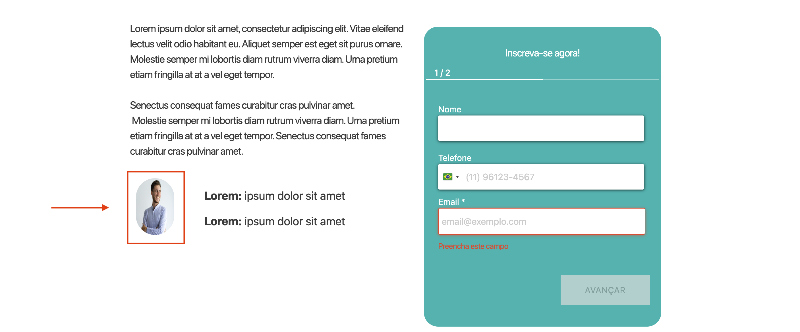

---

## 🐞 BUG 03 — Campo Nome aceita caracteres inválidos  

**Tipo:** Correção  
**Classificação:** Utilidade  
**Prioridade:** Alta  

### 📍 Descrição  
Campo aceita números e símbolos inválidos.

### 🔁 Passos  
1. Inserir números ou caracteres especiais no campo Nome  

### ✅ Resultado esperado  
Aceitar apenas letras válidas ou completamente limpo.

### ❌ Resultado atual  
Permite caracteres inválidos.

### 📸 Evidência  
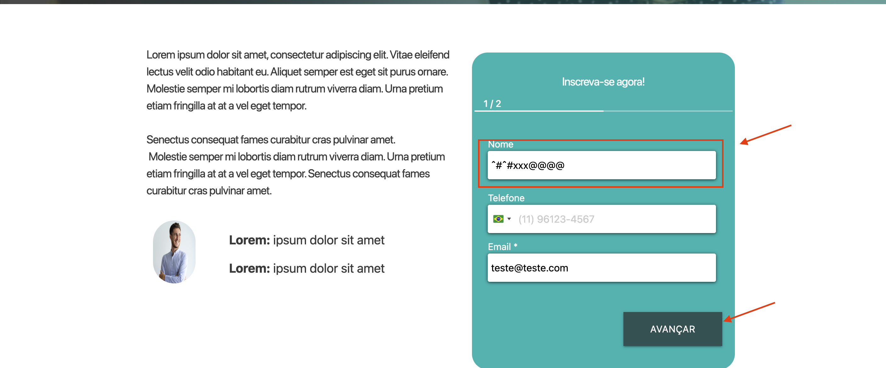

---

## 🐞 BUG 04 — Erro “É necessário informar a base legal” bloqueando avanço  

**Tipo:** Correção  
**Classificação:** Utilidade  
**Prioridade:** Alta  

### 🔁 Passos  
1. Preencher formulário  
2. Clicar em avançar  

### ✅ Resultado esperado  
Permitir avanço ou exibir campo correspondente.

### ❌ Resultado atual  
Exibe erro e impede progresso sem campo visível relacionado.

### 📸 Evidência  
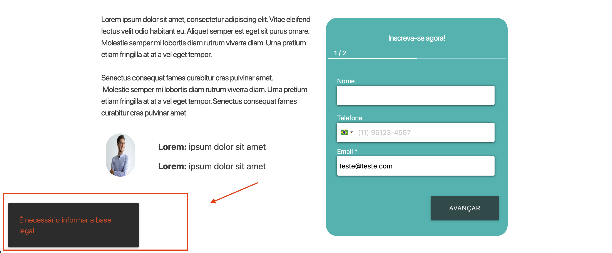

---

## 🐞 BUG 05 — Texto desalinhado na seção final  

**Tipo:** Melhoria  
**Classificação:** Desejabilidade  
**Prioridade:** Baixa  

### 🔁 Passos  
1. Acessar final da página  

### ✅ Resultado esperado  
Colunas alinhadas.

### ❌ Resultado atual  
Coluna 2 desalinhada.

### 📸 Evidência  
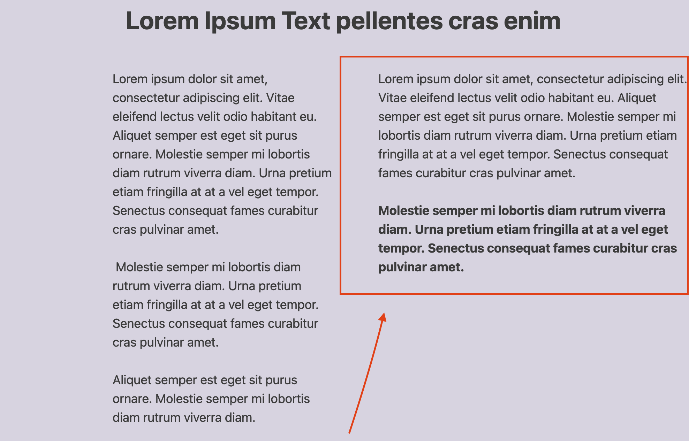

---

## 🐞 BUG 06 — Ícone incorreto em seção de texto  

**Tipo:** Correção  
**Classificação:** Desejabilidade  
**Prioridade:** Baixa  

### 🔁 Passos  
1. Acessar seção do texto citado  

### ✅ Resultado esperado  
Ícone coerente com o conteúdo.

### ❌ Resultado atual  
Ícone inconsistente.

### 📸 Evidência  
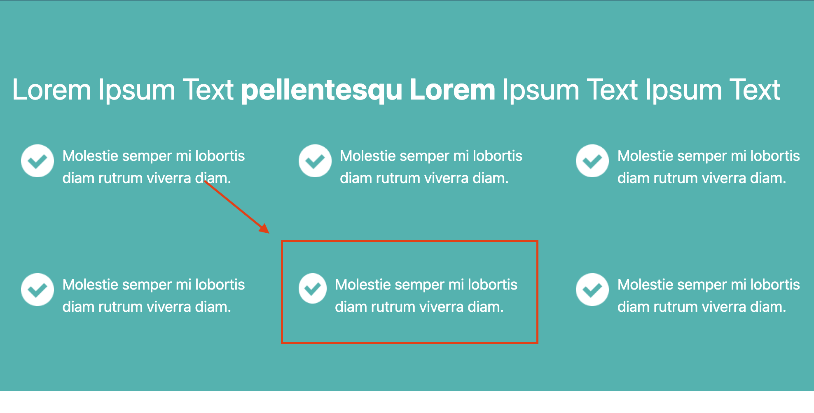

---

## 🐞 BUG 07 — “Saiba” em Outros Cursos sem ação  

**Tipo:** Correção  
**Classificação:** Utilidade  
**Prioridade:** Alta  

### 🔁 Passos  
1. Acessar seção “Outros Cursos”  
2. Clicar em “Saiba”

### ✅ Resultado esperado  
Redirecionar para página dos cursos.

### ❌ Resultado atual  
Nenhuma ação executada.

---

## 🐞 BUG 08 — Botão “Quero me certificar” redirecionando incorretamente  

**Tipo:** Correção  
**Classificação:** Utilidade  
**Prioridade:** Alta  

### 🔁 Passos  
1. Clicar no botão “Quero me certificar”

### ✅ Resultado esperado  
Redirecionar para página interna correta.

### ❌ Resultado atual  
Redireciona para o Google.

---

## 🐞 BUG 09 — Ícone do YouTube redirecionando para TikTok  

**Tipo:** Correção  
**Classificação:** Utilidade  
**Prioridade:** Média  

### 🔁 Passos  
1. Clicar no ícone do YouTube  

### ✅ Resultado esperado  
Abrir canal oficial do YouTube.

### ❌ Resultado atual  
Redireciona para TikTok.

---

## 🐞 BUG 10 — Layout quebrado em dispositivos móveis  

**Tipo:** Correção  
**Classificação:** Usabilidade  
**Prioridade:** Alta  

### 🔁 Passos  
1. Acessar o site em resolução mobile  

### ✅ Resultado esperado  
Layout responsivo e adaptado à tela.

### ❌ Resultado atual  
Elementos sobrepostos, quebra de grid e rolagem horizontal.

---

## 🐞 BUG 11 — Inconsistência de estilo entre botões “Quero me certificar”

**Tipo:** Correção  
**Classificação:** Desejabilidade  
**Prioridade:** Média  

### 📍 Descrição  
Existem dois botões “Quero me certificar” na página com diferença nas propriedades CSS `height` e `width`, resultando em variação visual de tamanho.

### 🔁 Passos para reproduzir  
1. Acessar a página principal  
2. Localizar os dois botões “Quero me certificar”  
3. Comparar visualmente ou inspecionar via DevTools  

### ✅ Resultado esperado  
Ambos os botões devem possuir os mesmos valores de:
- `height`
- `width`

Mantendo padronização conforme o design system.

### ❌ Resultado atual  
Os botões apresentam valores diferentes de `height` e `width`, causando inconsistência visual.

---

## 🐞 BUG 12 — Imagens dos cards em “Outros Cursos” quebram no responsivo

**Tipo:** Correção  
**Classificação:** Usabilidade  
**Prioridade:** Alta  

### 📍 Descrição  
As imagens presentes nos cards da seção “Outros Cursos” não se adaptam corretamente em resoluções menores, causando quebra de layout.

### 🔁 Passos para reproduzir  
1. Acessar a seção “Outros Cursos”  
2. Reduzir a largura da tela ou visualizar em dispositivo mobile  
3. Observar o comportamento das imagens nos cards  

### ✅ Resultado esperado  
As imagens devem se adaptar ao tamanho do container utilizando comportamento responsivo (ex: ajuste proporcional dentro do card), sem quebrar o layout.

### ❌ Resultado atual  
As imagens ultrapassam o container ou distorcem, causando quebra visual e desalinhamento dos cards.

---

## 🐞 BUG 13 — Botão “Avançar” sem `border-radius`

**Tipo:** Correção  
**Classificação:** Desejabilidade  
**Prioridade:** Baixa  

### 📍 Descrição  
O botão “Avançar” dentro do formulário não possui a propriedade CSS `border-radius`, ficando visualmente inconsistente em relação aos demais botões da interface.

### 🔁 Passos para reproduzir  
1. Acessar o formulário  
2. Localizar o botão “Avançar”  
3. Comparar visualmente com outros botões da página  

### ✅ Resultado esperado  
O botão deve seguir o mesmo padrão visual dos demais, incluindo a propriedade `border-radius` conforme definido no design system.

### ❌ Resultado atual  
Botão apresenta bordas retas, divergindo do padrão visual aplicado aos outros botões.

---

## 🐞 BUG 14 — Espaçamento indevido no início do texto

**Tipo:** Correção  
**Classificação:** Desejabilidade  
**Prioridade:** Baixa  

### 📍 Descrição  
O texto inicia com um espaço em branco indevido (possível presença de `&nbsp;` ou whitespace extra), causando desalinhamento visual em relação aos demais parágrafos.

### 🔁 Passos para reproduzir  
1. Acessar a seção onde o texto está localizado  
2. Observar o início do parágrafo  

### ✅ Resultado esperado  
O texto deve iniciar alinhado ao container, sem espaços ou caracteres invisíveis no início.

### ❌ Resultado atual  
Existe um espaço inicial que desloca o texto e compromete o alinhamento visual.

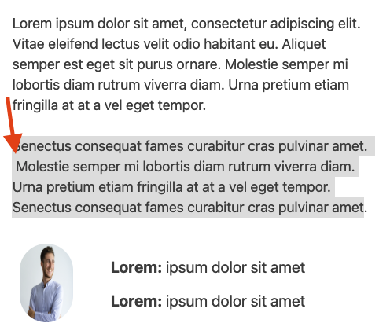

---

## 🐞 BUG 15 — Alteração indevida do texto do botão em resolução menor

**Tipo:** Correção  
**Classificação:** Usabilidade  
**Prioridade:** Média  

### 📍 Descrição  
Em resolução 926x654, o texto do botão é alterado de “Avançar” para “Avança”, indicando mudança indevida de conteúdo baseada em breakpoint.

### 🔁 Passos para reproduzir  
1. Acessar o formulário  
2. Ajustar a resolução para 926x654  
3. Comparar o texto do botão com a versão desktop  

### ✅ Resultado esperado  
O botão deve manter o texto “Avançar” em todas as resoluções, preservando consistência de conteúdo.

### ❌ Resultado atual  
O texto é modificado para “Avança” em resoluções menores, gerando inconsistência na interface.

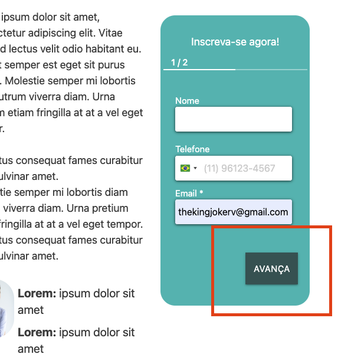

---

## 🐞 BUG 16 — Inconsistência de texto no botão do card “Outros Cursos”

**Tipo:** Correção  
**Classificação:** Usabilidade  
**Prioridade:** Média  

### 📍 Descrição  
O primeiro card da seção “Outros Cursos” apresenta o botão com o texto “Saiba”, enquanto os demais utilizam “Saiba mais”, gerando inconsistência de conteúdo.

### 🔁 Passos para reproduzir  
1. Acessar a seção “Outros Cursos”  
2. Comparar o texto do botão do primeiro card com os demais  

### ✅ Resultado esperado  
Todos os cards devem utilizar o mesmo padrão de texto no botão, mantendo consistência (“Saiba mais”).

### ❌ Resultado atual  
O primeiro card exibe apenas “Saiba”, divergindo do padrão aplicado nos demais.

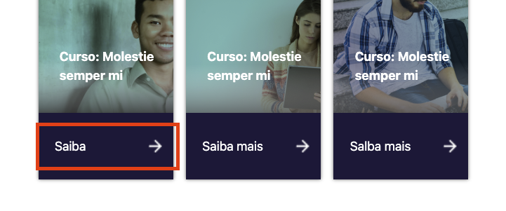

---
## Site - Site

## 🐞 BUG 017 — Botão “Atendimento” redirecionando incorretamente  

**Tipo:** Correção  
**Classificação:** Utilidade  
**Prioridade:** Alta  

### 📍 Descrição  
O botão “Atendimento” redireciona diretamente para o WhatsApp, em vez de exibir ou direcionar para um número de contato institucional conforme esperado.

### 🔁 Passos para reproduzir  
1. Acessar a página principal  
2. Clicar no botão “Atendimento”  

### ✅ Resultado esperado  
Exibir número oficial de contato ou redirecionar para página institucional de atendimento.

### ❌ Resultado atual  
Redirecionamento automático para o WhatsApp.

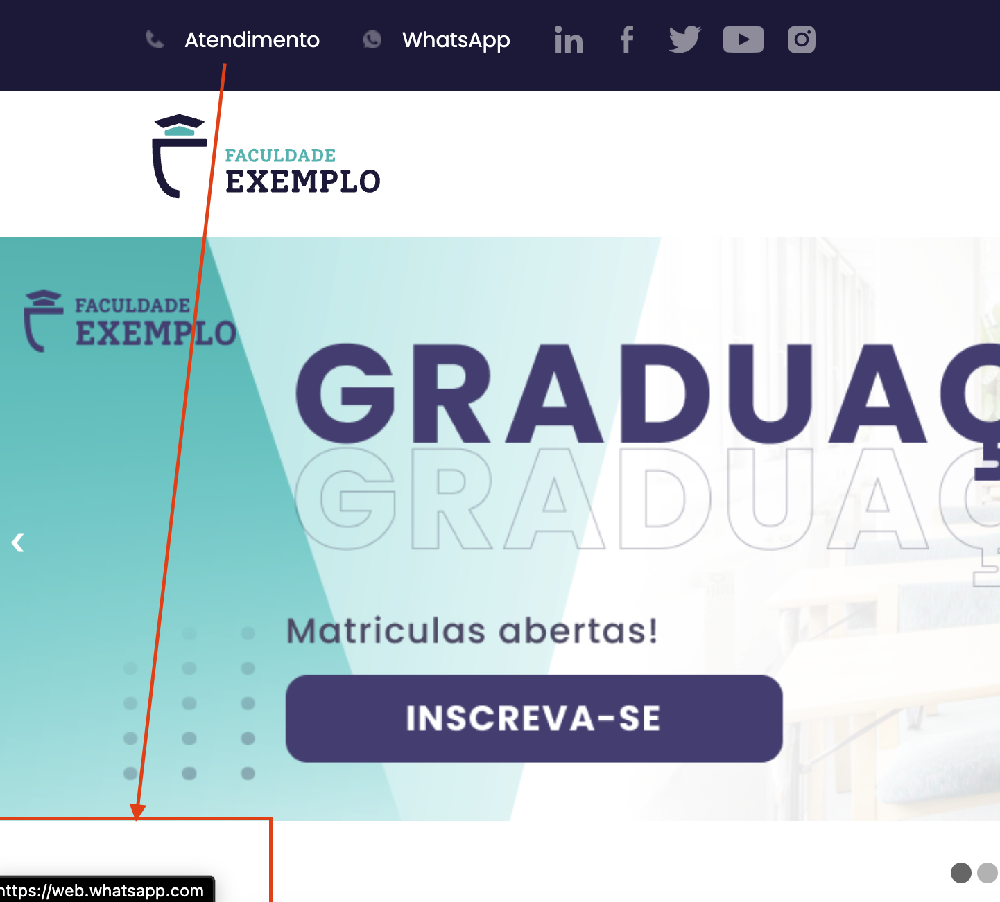
---

## 🐞 BUG 018 — Ícones das redes sociais desalinhados  

**Tipo:** Correção  
**Classificação:** Desejabilidade  
**Prioridade:** Média  

### 📍 Descrição  
Os ícones das redes sociais estão visualmente desalinhados e apresentam inclinação/posição irregular.

### 🔁 Passos para reproduzir  
1. Acessar o rodapé ou seção das redes sociais  
2. Observar o alinhamento dos ícones  

### ✅ Resultado esperado  
Ícones alinhados horizontalmente e padronizados conforme design system.

### ❌ Resultado atual  
Ícones tortos e desalinhados.

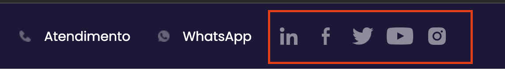
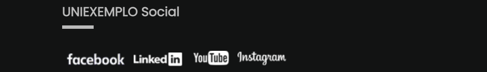

---

## 🐞 BUG 019 — Ícone incorreto da rede X  

**Tipo:** Correção  
**Classificação:** Desejabilidade  
**Prioridade:** Baixa  

### 📍 Descrição  
A rede X está representada pelo antigo símbolo de passarinho, em vez do novo logotipo oficial “X”.

### 🔁 Passos para reproduzir  
1. Localizar ícone da rede X  
2. Verificar o símbolo utilizado  

### ✅ Resultado esperado  
Utilizar o logotipo atual da plataforma (símbolo “X”).

### ❌ Resultado atual  
Exibição do antigo símbolo de passarinho.

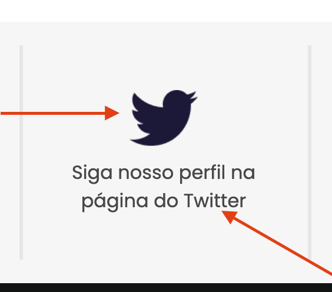
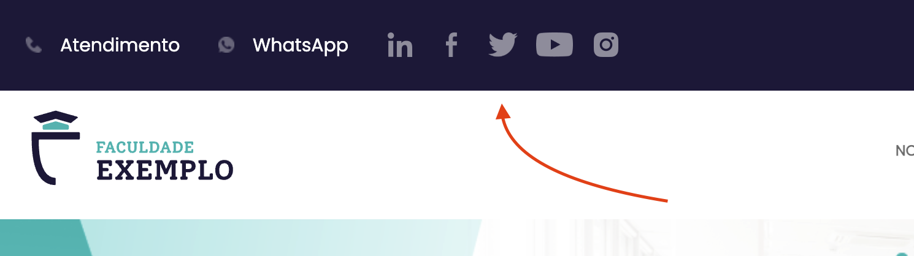

---

## 🐞 BUG 020 — Carrossel não realiza transição automática  

**Tipo:** Correção  
**Classificação:** Usabilidade  
**Prioridade:** Alta  

### 📍 Descrição  
O carrossel de imagens permanece estático e não realiza rotação automática nem manual.

### 🔁 Passos para reproduzir  
1. Acessar a seção do carrossel  
2. Aguardar transição automática ou tentar interação manual  

### ✅ Resultado esperado  
Realizar troca automática de imagens e permitir navegação manual.

### ❌ Resultado atual  
Imagens permanecem travadas sem transição.

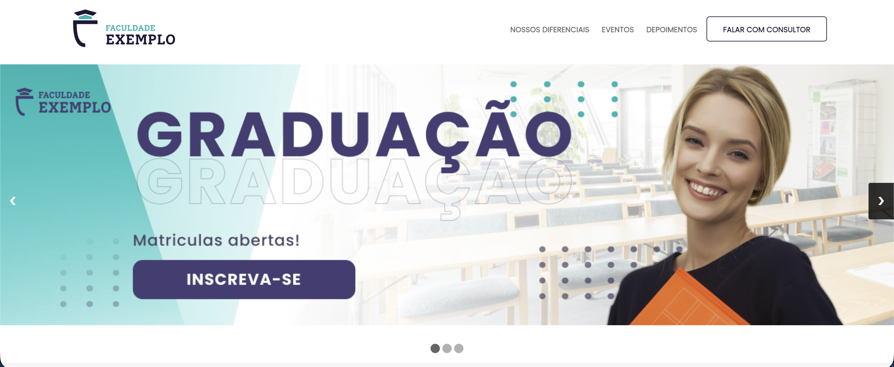
---

## 🐞 BUG 021 — Campo Nome permite números  

**Tipo:** Correção  
**Classificação:** Utilidade  
**Prioridade:** Alta  

### 📍 Descrição  
O campo “Nome” do formulário permite a inserção de números.

### 🔁 Passos para reproduzir  
1. Acessar o formulário  
2. Inserir números no campo “Nome”  

### ✅ Resultado esperado  
Aceitar apenas letras válidas.

### ❌ Resultado atual  
Permite inserção de números.

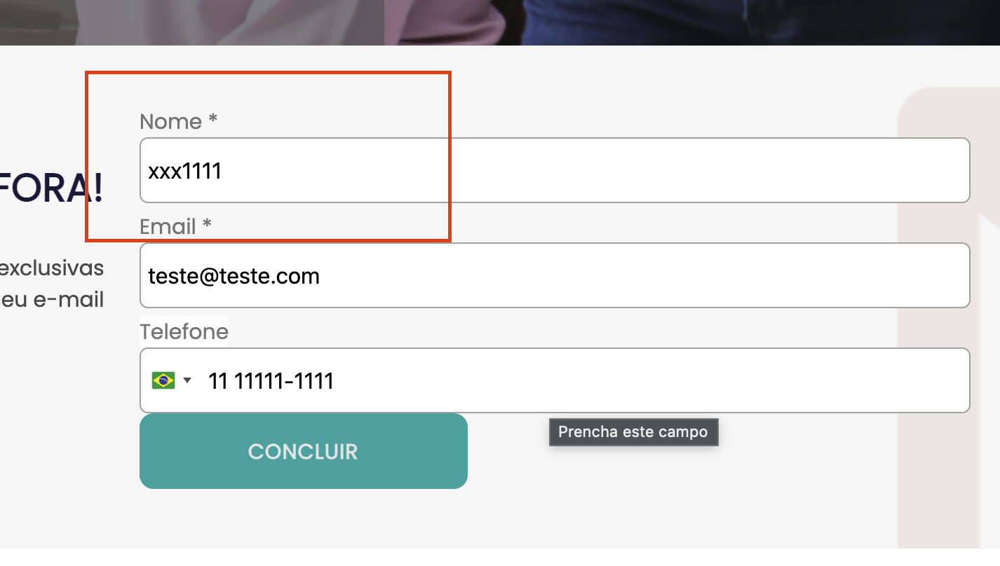

---

## 🐞 BUG 022 — Botão “Concluir” sobrepondo input  

**Tipo:** Correção  
**Classificação:** Usabilidade  
**Prioridade:** Alta  

### 📍 Descrição  
O botão “Concluir” está com tamanho excessivo e encosta/sobrepõe um campo de input do formulário.

### 🔁 Passos para reproduzir  
1. Acessar o formulário  
2. Observar o posicionamento do botão “Concluir”  

### ✅ Resultado esperado  
Botão dimensionado corretamente, sem sobreposição de elementos.

### ❌ Resultado atual  
Botão grande demais, invadindo a área de um input.

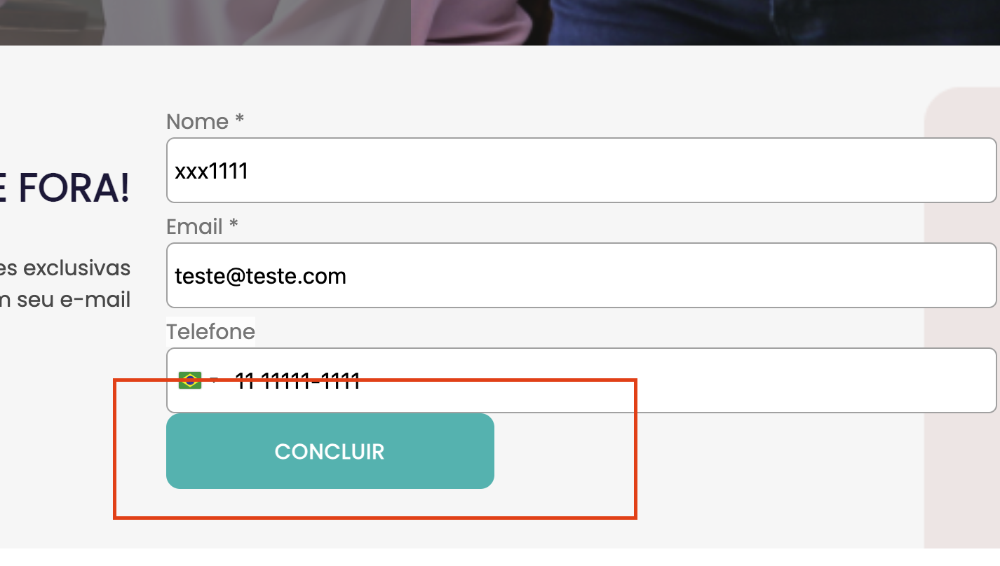

---

## 🐞 BUG 023 — Problemas de responsividade em múltiplas seções  

**Tipo:** Correção  
**Classificação:** Usabilidade  
**Prioridade:** Alta  

### 📍 Descrição  
O site apresenta falhas visuais de responsividade em múltiplas seções, causando quebra de layout em resoluções menores.

### 🔁 Passos para reproduzir  
1. Acessar a página principal  
2. Reduzir a largura da tela ou visualizar em dispositivo mobile  
3. Navegar pelas diferentes seções da página  

### ✅ Resultado esperado  
Layout adaptável a diferentes resoluções, mantendo alinhamento, proporção e organização dos elementos.

### ❌ Resultado atual  
Elementos desalinhados, sobrepostos, com quebra de grid e inconsistência visual em diversas seções.

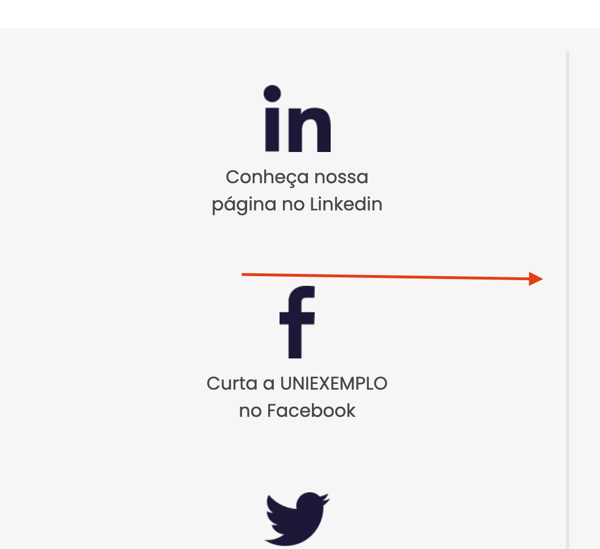

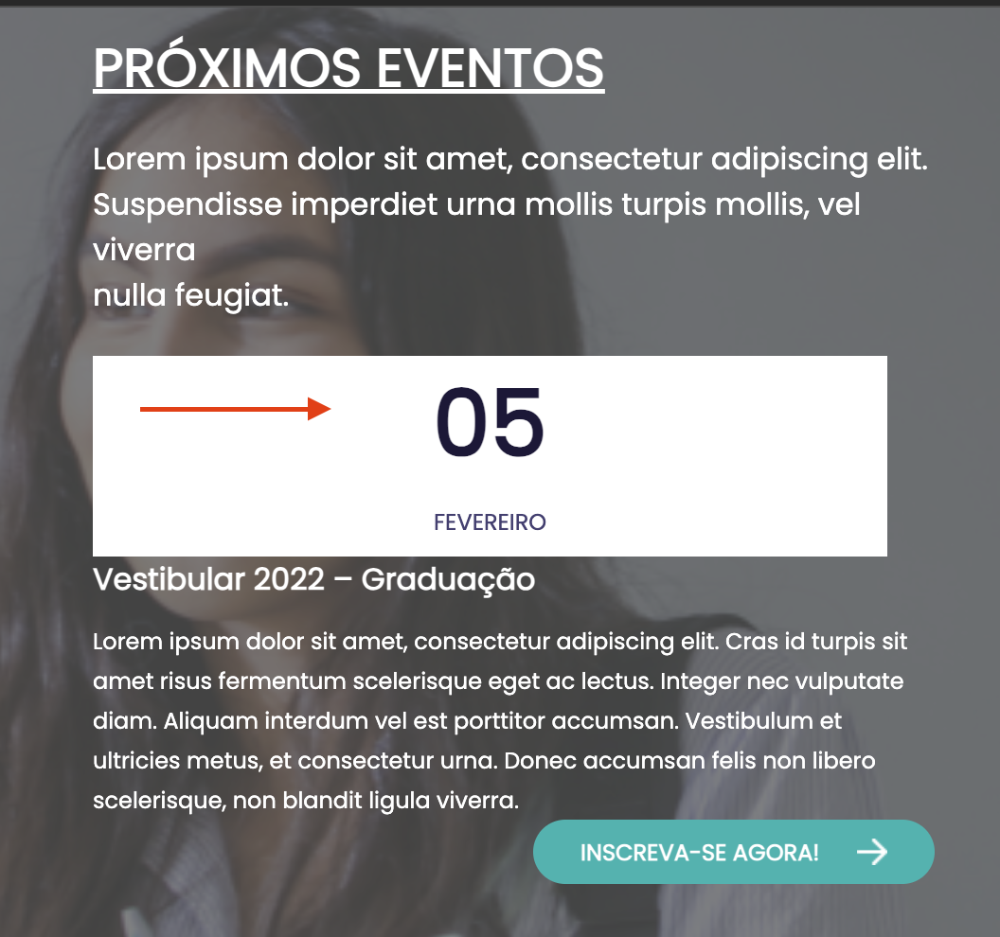

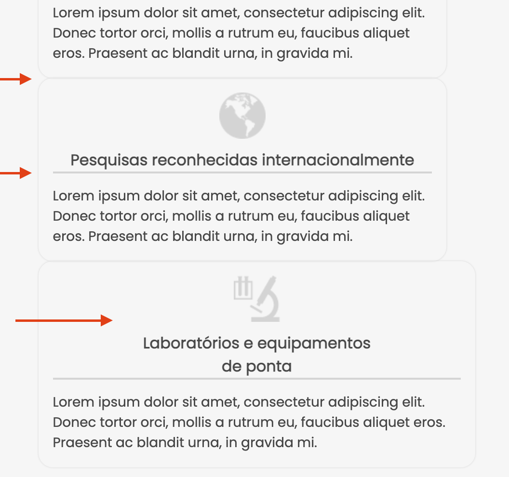

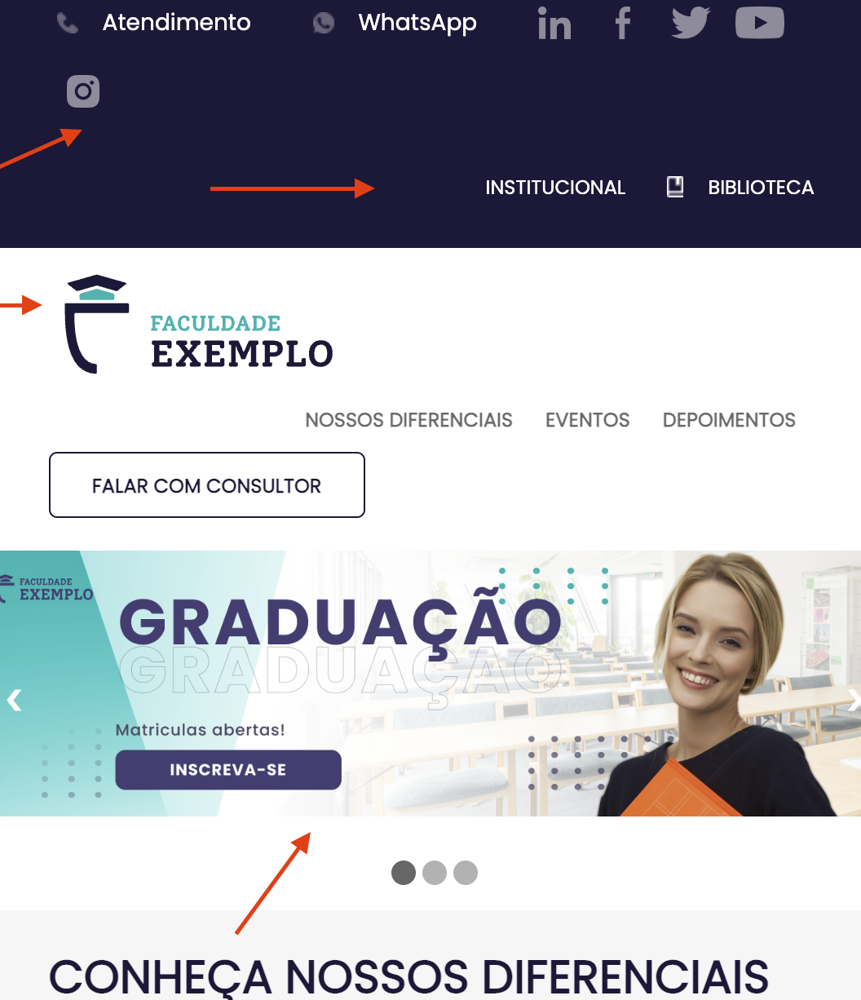

